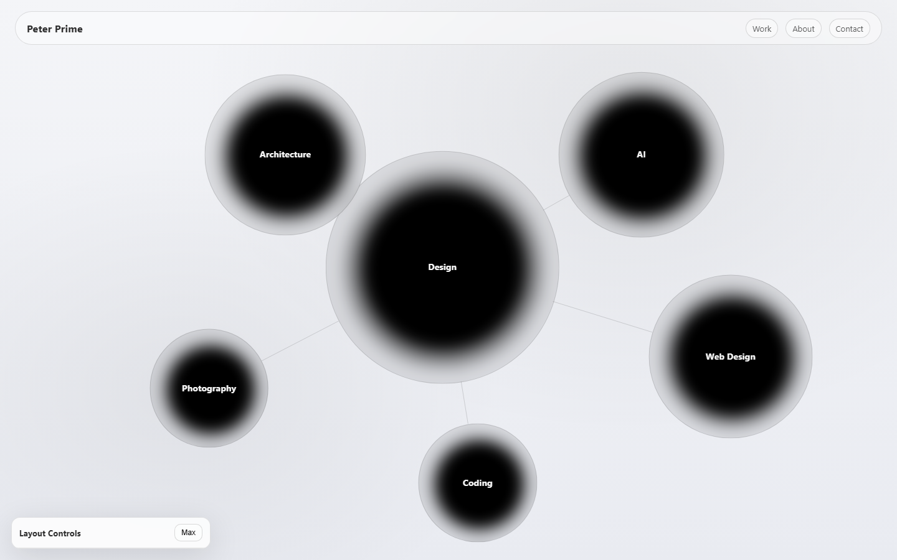

# Bubble Layout Editor

An interactive, metaball-rendered node graph — built as the navigation layer for a portfolio site, and as a tool for a design method I'd been doing by hand.

**[Live demo →](#)** *(add URL after deploy)*

## What it is

Six nodes on an adjacency graph, rendered as a continuous metaball field on a `<canvas>`. Drag a node and the field re-solves. Expand a node and its sub-nodes fan out on an auto-computed radial layout. Everything is editable live and exports to JSON.

No frameworks, no dependencies, no build step. One 42 KB HTML file — vanilla JS, a 2D canvas, and an SVG line layer.

## Why it exists

My architecture thesis (GreenArc Biscayne) used a **bubble-adjacency algorithm** to generate building massing: take a space-program spreadsheet, overlap the programs by adjacency, scale each by square footage, and let circulation fall out of the result. I did the early passes of that by hand, in Rhino and Grasshopper.

This is that method, rebuilt as a piece of software you can actually manipulate — and then pointed at a different problem (site navigation) to see if the abstraction held.

It did. The layout engine doesn't know or care whether a node is a building program or a portfolio section.

## Features

- **Metaball field rendering** — marching-squares-style scalar field over a 2D canvas, with live `resolution` / `threshold` controls (separate values for collapsed vs. expanded states)
- **Adjacency graph** — SVG connector layer, recomputed on drag
- **Sub-node expansion** — click a node, children fan out on a computed radial layout; siblings dim
- **Direct manipulation** — drag to move, scroll-wheel to resize
- **Persistence** — panel position persists to `localStorage`; full graph exports as JSON (`Copy main JSON` / `Download ALL JSON`)
- **Live parameter editing** — every node's `x`, `y`, `r`, `label`, `href` and per-node metaball settings are editable in-panel

## Stack

Vanilla JS. Canvas 2D. SVG. Zero dependencies.

## Status

The layout engine and editor are complete and working. The `href` routing (clicking a bubble to navigate to a section) is stubbed — nodes carry an `href` field but the destination pages aren't built yet.

---

*Peter Dravgalis — M.Arch, Florida International University*
